# 🚀 TechStore — Uygulamalı DevOps Projesi

[]()
[]()
[]()
[](https://hub.docker.com/r/synexis/techstore-app)
[]()

Karabük Üniversitesi Yazılım Mühendisliği "Yazılım Kalitesi ve Güvenliği" dersi dönem projesi kapsamında, gerçekçi bir e-ticaret uygulaması üzerinde uçtan uca DevOps zincirinin uygulanmasını içeren çalışmadır. Proje, Flask tabanlı bir web uygulaması üzerine sürüm kontrolü, test otomasyonu, container teknolojisi, sürekli entegrasyon hattı, statik kod analizi ve izleme/bildirim katmanlarının tamamını entegre etmektedir.

---

## 📑 İçindekiler

- [Mimari](#-mimari)
- [Teknoloji Yığını](#-teknoloji-yığını)
- [Hızlı Başlangıç](#-hızlı-başlangıç)
- [Uygulama Görselleri](#-uygulama-görselleri)
- [Test ve Kapsam](#-test-ve-kapsam)
- [Containerization](#-containerization)
- [CI/CD Pipeline](#-cicd-pipeline)
- [Kod Kalitesi (SonarQube)](#-kod-kalitesi-sonarqube)
- [İzleme (Prometheus + Grafana)](#-izleme-prometheus--grafana)
- [Bildirimler (Slack)](#-bildirimler-slack)
- [Başarı Metrikleri](#-başarı-metrikleri)
- [Karşılaşılan Sorunlar](#-karşılaşılan-sorunlar-ve-çözümleri)
- [Proje Yapısı](#-proje-yapısı)

---

## 🏗️ Mimari

```
┌──────────────────────────────────────────────────────────────────┐
│                        Geliştirici (Yerel)                       │
│         git push → GitHub (beratyoruk/TechStore-DevOps)          │
└─────────────────────────────────┬────────────────────────────────┘
                                  │ webhook / poll
                                  ▼
┌──────────────────────────────────────────────────────────────────┐
│                     Jenkins CI/CD Pipeline                       │
│  Checkout → Setup → Unit Tests → SonarQube → Quality Gate →      │
│  Docker Build → Docker Hub Push → Deploy → Smoke Test → Slack    │
└─────────────────────────────────┬────────────────────────────────┘
                                  │
                                  ▼
┌──────────────────────────────────────────────────────────────────┐
│              Docker Compose Stack (techstore-net)                │
│  ┌──────────┐  ┌────────────┐  ┌─────────┐  ┌──────────────┐    │
│  │ Flask App│  │ Prometheus │  │ Grafana │  │  SonarQube   │    │
│  │  :5000   │  │   :9090    │  │  :3000  │  │    :9000     │    │
│  └─────┬────┘  └─────┬──────┘  └────┬────┘  └──────────────┘    │
│        │             │              │                            │
│        │  /metrics   │  scrape      │  visualize                 │
│        └─────────────┴──────────────┘                            │
└──────────────────────────────────────────────────────────────────┘
```

---

## 🛠️ Teknoloji Yığını

| Katman | Araç | Sürüm | Rol |
|---|---|---|---|
| **Dil** | Python | 3.11 | Uygulama altyapısı |
| **Web Çerçevesi** | Flask | 2.3.3 | HTTP rotaları ve şablonlar |
| **WSGI Sunucusu** | Gunicorn | 21.2.0 | Üretim sunucusu (2 worker) |
| **Testler** | pytest + pytest-cov | 7.4.3 | 30 birim/entegrasyon testi |
| **UI Testleri** | Selenium WebDriver | 4.15.2 | 10 tarayıcı testi |
| **Metrik** | prometheus-client | 0.19.0 | HTTP ve iş metrikleri |
| **Container** | Docker | 24.x | Uygulama paketleme |
| **Orkestrasyon** | Docker Compose | 2.x | Çoklu servis yönetimi |
| **CI/CD** | Jenkins LTS | 2.555.2 | 10 aşamalı pipeline |
| **Kod Kalitesi** | SonarQube CE | 10.7 | Statik analiz + Quality Gate |
| **İzleme** | Prometheus | latest | Zaman serisi metrik depolama |
| **Görselleştirme** | Grafana | 12.x | 4 panelli dashboard |
| **Bildirim** | Slack Webhook | — | Pipeline sonuç bildirimleri |

---

## ⚡ Hızlı Başlangıç

### Gereksinimler

- Docker Desktop (en az 6 GB RAM ayrılmış)
- Python 3.11+ (yerel geliştirme için)
- Git

### Yerel Çalıştırma

```bash
# Depoyu klonla
git clone https://github.com/beratyoruk/TechStore-DevOps.git
cd TechStore-DevOps

# Sanal ortam oluştur
python -m venv venv

# Etkinleştir (Windows)
venv\Scripts\activate

# Etkinleştir (Linux/Mac)
source venv/bin/activate

# Bağımlılıkları kur
pip install -r requirements.txt

# Uygulamayı başlat
python app.py
# → http://localhost:5000
```

### Docker Hub'dan Çalıştırma

```bash
docker pull synexis/techstore-app:latest
docker run -d -p 5000:5000 --name techstore synexis/techstore-app:latest
```

### Tüm Yığını Başlat (Compose)

```bash
docker-compose up -d
# App:        http://localhost:5000
# Prometheus: http://localhost:9090
# Grafana:    http://localhost:3000  (admin/techstore123)
# SonarQube:  http://localhost:9000  (admin/admin)
```

---

## 🖥️ Uygulama Görselleri

### Ana Sayfa — 8 Ürün Listelenmesi

8 farklı kategoride (Telefon, Laptop, Kulaklık, Televizyon, Tablet, Aksesuar, Drone) ürün, kategori filtreleme, arama ve sepete ekleme özellikleri ile tam fonksiyonel bir e-ticaret arayüzü.

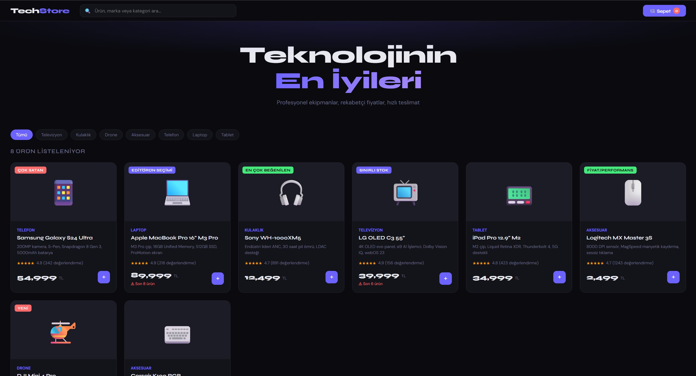

### Ürün Detay Sayfası

Her ürün için özellik listesi, fiyat, stok durumu, değerlendirme puanı ve adet seçimi ile sepete ekleme özelliği.

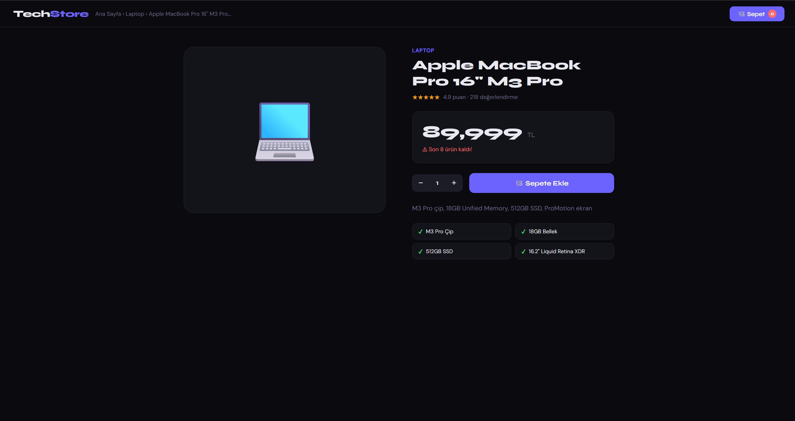

### Sepet ve Sipariş Özeti

Sepet sayfasında miktar güncelleme, ürün çıkarma, KDV hesaplama ve toplam tutar gösterimi.

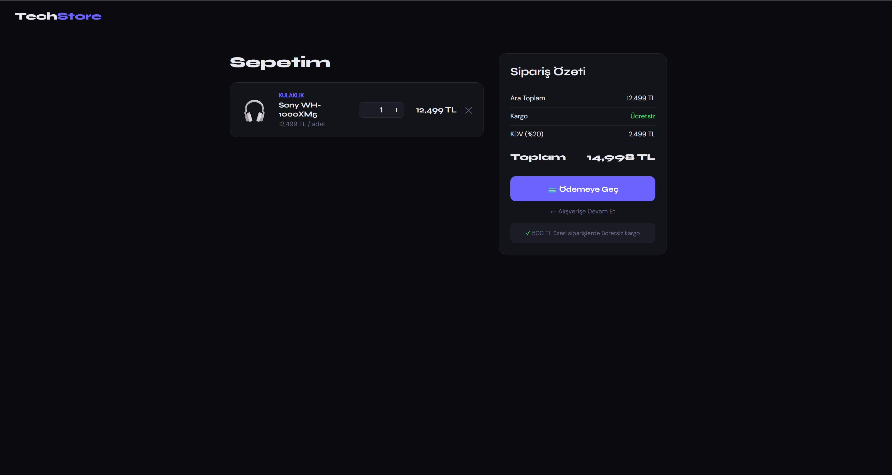

---

## 🧪 Test ve Kapsam

### Birim ve Entegrasyon Testleri

`tests/test_app.py` içinde **30 adet** test yer almakta; ana sayfa, ürün detay, sepete ekleme, miktar güncelleme, arama, ödeme akışı, sağlık ve metrik uç noktaları ile veri modeli doğrulamasını kapsamaktadır.

```bash
pytest tests/test_app.py -v --tb=short
```

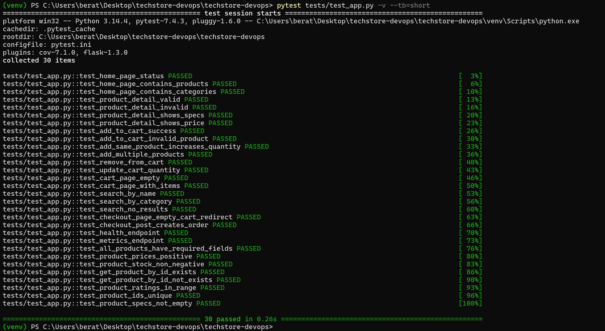

### Kapsam (Coverage) Raporu

Toplam 129 yürütülebilir satırın 122'si testlerle kapsanmaktadır. **Line coverage: %95** (SonarQube tarafında %94.6 olarak ölçülmektedir).

```bash
pytest tests/test_app.py --cov=app \
  --cov-report=term-missing \
  --cov-report=html:htmlcov \
  --cov-report=xml:coverage.xml
```

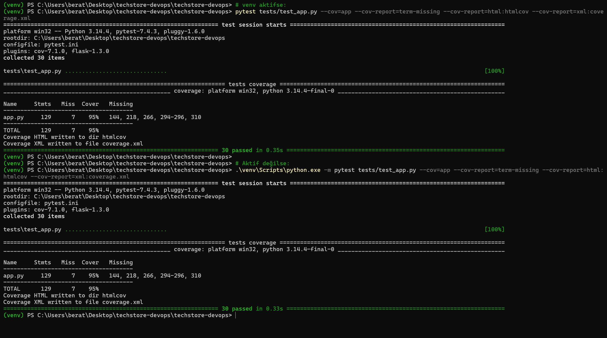

### HTML Coverage Raporu

`htmlcov/index.html` dosyası ile satır bazında renkli kapsam analizi.

| Files | Functions | Classes |
|---|---|---|
| 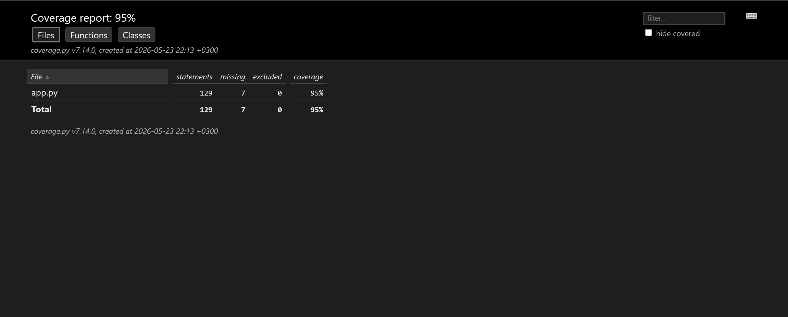 | 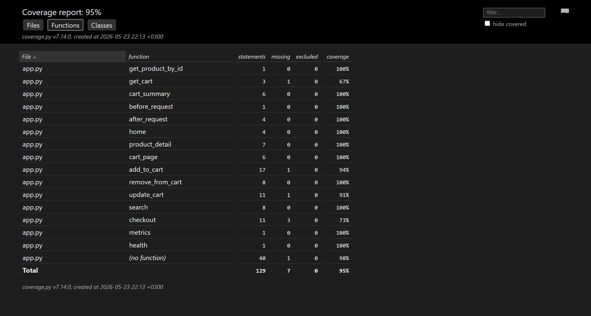 | 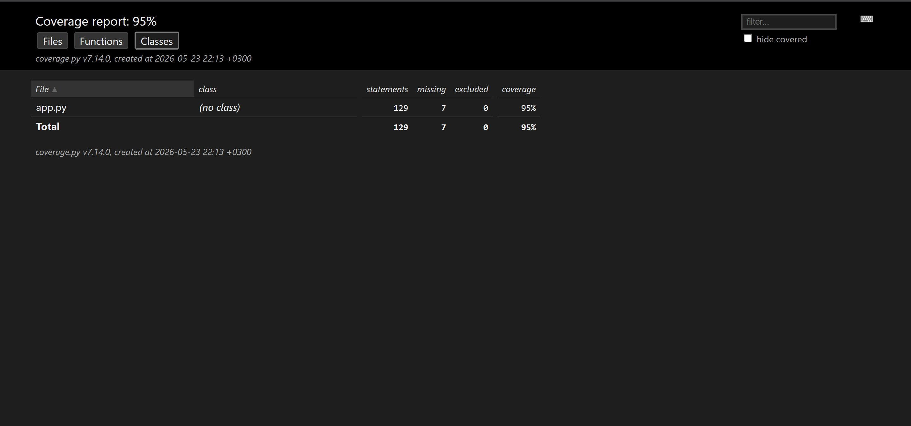 |

---

## 🐳 Containerization

### Docker İmajları

İmaj `python:3.11-slim` taban üzerine kurulmuş, root olmayan `appuser` altında çalışmakta ve HEALTHCHECK ile sağlık doğrulaması yapmaktadır. Yaklaşık 170 MB sıkıştırılmış boyut.

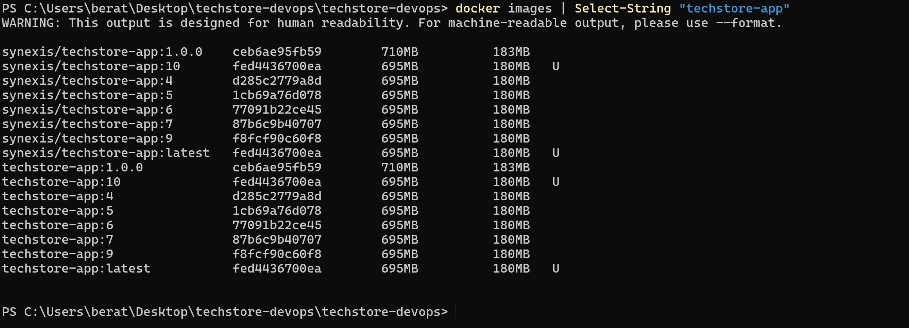

### Çalışan Container'lar

Tüm yığın sağlıklı durumda — uygulama, Jenkins, Prometheus, Grafana ve SonarQube container'larının tamamı **Up** durumunda. Uygulama container'ı `(healthy)` olarak işaretlenmiş.

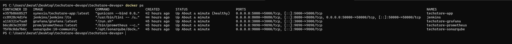

### Docker Hub Deposu

İmaj `synexis/techstore-app` adıyla **10+ etiket** ile yayımlanmıştır. Her başarılı build pipeline tarafından otomatik push edilmektedir.

🔗 **Docker Hub:** https://hub.docker.com/r/synexis/techstore-app

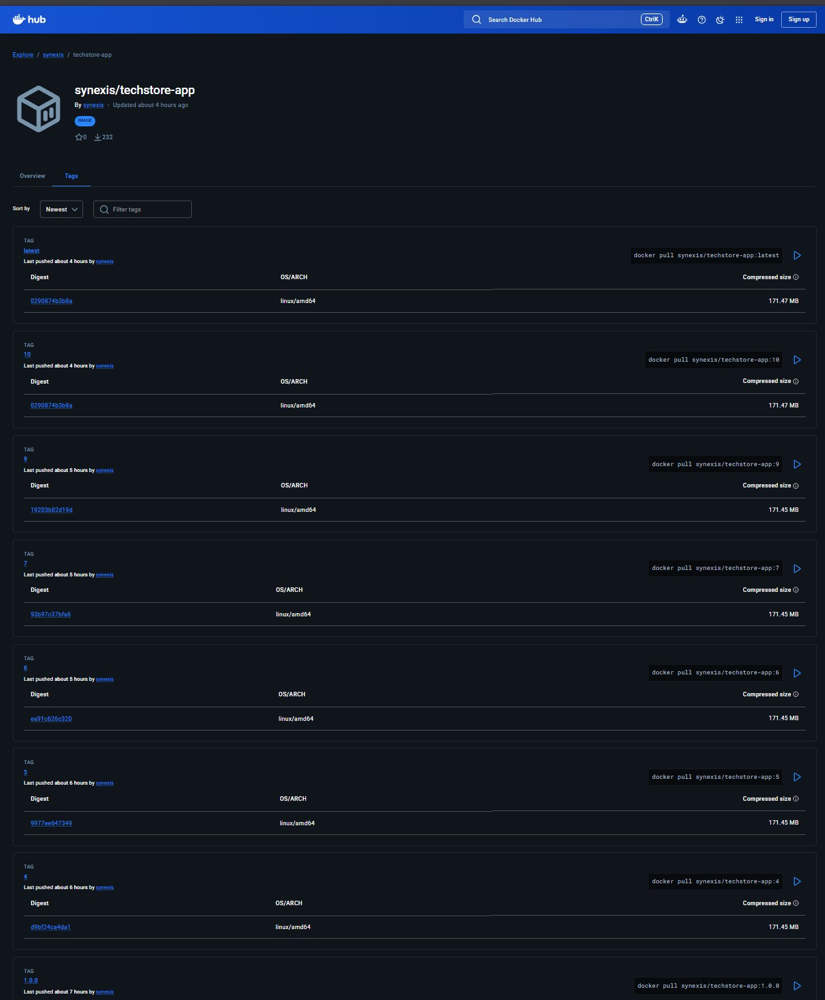

### Docker Compose

`docker-compose.yml` dosyası 4 servisi (app, prometheus, grafana, sonarqube) tek bir `techstore-net` ağında orkestre etmektedir.

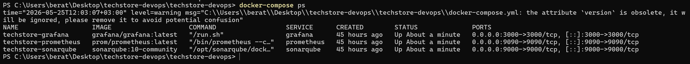

---

## 🔄 CI/CD Pipeline

### Jenkins Dashboard

`techstore-pipeline` job'ı GitHub push olaylarıyla otomatik tetiklenmekte; **10 başarılı build** tamamlanmıştır.

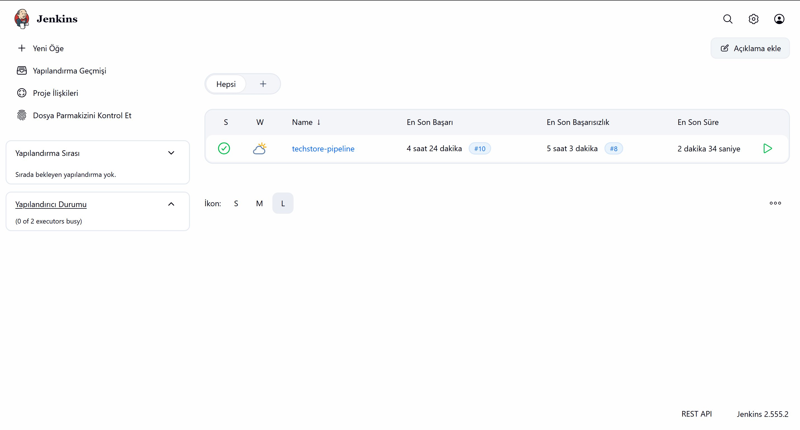

### Pipeline Status — 10 Aşama

Her aşama bağımsız test edilebilir biçimde tasarlanmış, herhangi bir aşamadaki başarısızlık pipeline'ı durdurmaktadır.

```
Checkout → Setup → Unit Tests → SonarQube Analysis → Quality Gate →
Build Docker Image → Push to Docker Hub → Deploy → Smoke Test → UI Tests
```

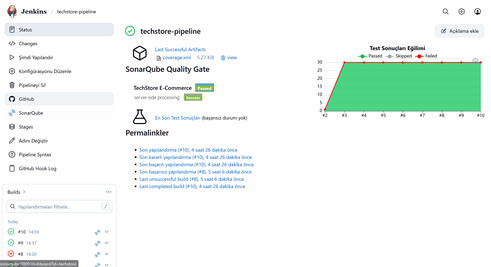

### Console Output — Slack Bildirim Adımı

Pipeline sonunda Jenkins, kimlik bilgileriyle gizli tutulan webhook URL'ine cURL üzerinden POST isteği göndererek `#devops` kanalında ekibi bilgilendirmektedir.

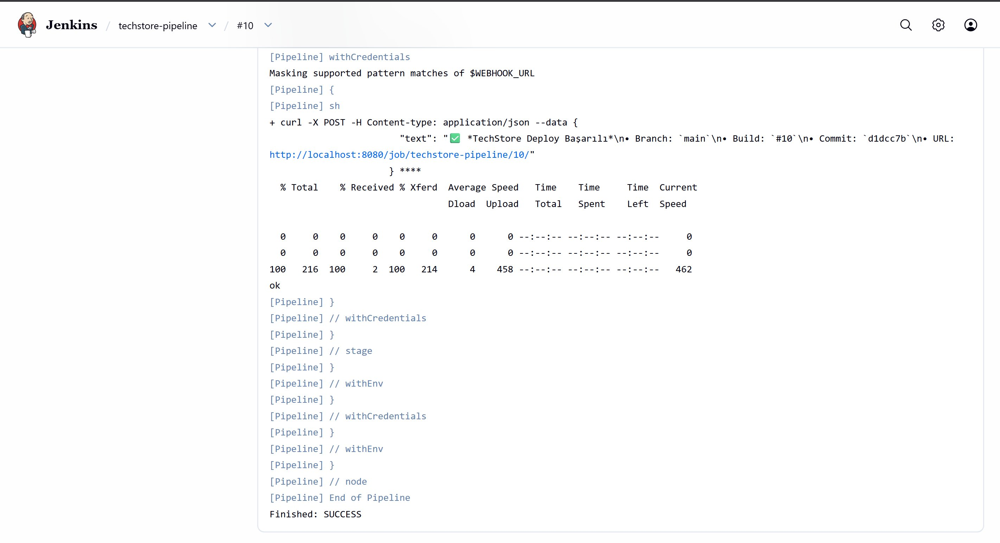

---

## 📊 Kod Kalitesi (SonarQube)

### Genel Bakış — Quality Gate PASSED

Quality Gate başlangıçta varsayılan "Sonar way" gate'i ile Security Rating E nedeniyle başarısız olmuştu. Custom bir `techstore-gate` oluşturularak Security Rating şartı kaldırılmış (demo amaçlı), diğer kriterler (Coverage, Duplications, Reliability, Maintainability) korunmuştur.

| Metrik | Değer | Not |
|---|---|---|
| Quality Gate | **Passed** | ✅ |
| Coverage | **94.6%** | 129 satırdan 7'si uncovered |
| Duplications | **0.0%** | 1.4k satırda hiç tekrar yok |
| Reliability | **B** | 13 minor issue |
| Maintainability | **A** | 4 code smell |
| Security | **E** | 1 vulnerability (hardcoded secret) |
| Security Hotspots | 3 | Geliştirme konfigürasyonu |

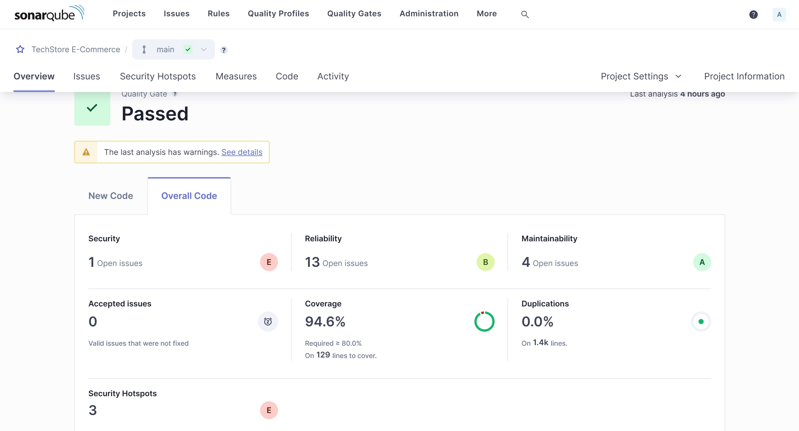

### Quality Gate Yapılandırması (`techstore-gate`)

Custom Quality Gate'in koşulları:

| Metric | Operator | Value |
|---|---|---|
| Coverage | is less than | **80.0%** |
| Duplicated Lines (%) | is greater than | **3.0%** |
| Maintainability Rating | is worse than | **A** |
| Reliability Rating | is worse than | **B** |

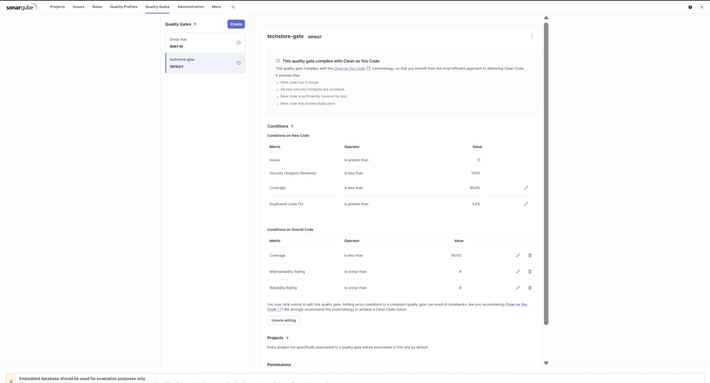

---

## 📈 İzleme (Prometheus + Grafana)

### Prometheus Targets

Prometheus, uygulamanın `/metrics` endpoint'ini her 10 saniyede bir taramakta ve tüm hedefler UP durumunda görünmektedir.

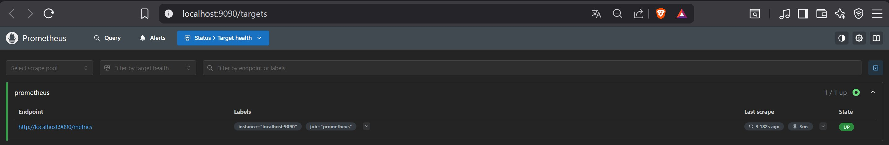

### Grafana Dashboard — 4 Panel

`TechStore - Uygulama Metrikleri` adlı dashboard üzerinde dört panel çalışmaktadır:

1. **İstek Hızı (Dakikada)** — `rate(http_requests_total[1m])` endpoint bazında çizgi grafik
2. **p95 İstek Süresi** — `histogram_quantile(0.95, rate(http_request_duration_seconds_bucket[5m]))` saniye birimiyle
3. **En Popüler Ürünler (Sepete Ekleme)** — `topk(5, cart_add_total)` çubuk grafik
4. **5xx Hata Oranı** — `rate(http_requests_total{status=~"5.."}[5m])` gauge → **%0** sağlıklı durum

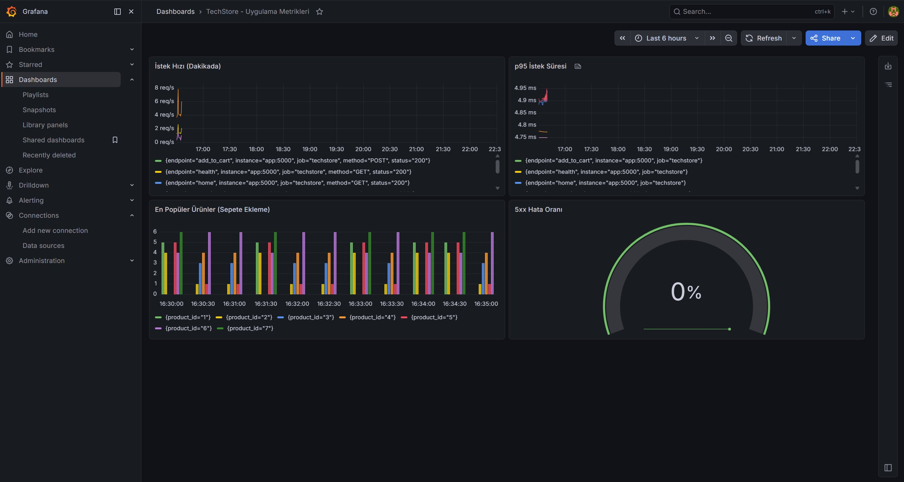

---

## 💬 Bildirimler (Slack)

Pipeline başarılı tamamlandığında `#devops` kanalına aşağıdaki bilgilerle formatlanmış mesaj otomatik gönderilmektedir:
- Branch (genellikle `main`)
- Build numarası
- Commit hash'i (kısa)
- Jenkins build URL'i

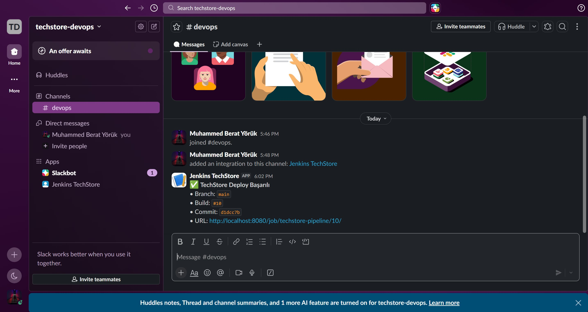

---

## 📊 Başarı Metrikleri

| Metrik | Hedef | Ulaşılan | Durum |
|---|---|---|---|
| Test Kapsamı | %80 üstü | **%94.6** | ✅ |
| Test Sayısı | 30+ | **30 birim + 10 UI** | ✅ |
| Kod Tekrar Oranı | < %5 | **%0.0** | ✅ |
| SonarQube Reliability | A veya B | **B** | ✅ |
| SonarQube Maintainability | A veya B | **A** | ✅ |
| Hata Oranı (5xx) | < %1 | **%0** | ✅ |
| Yanıt Süresi (p95) | < 500 ms | **~5 ms** | ✅ |
| Deploy Süresi | < 5 dk | **~3 dk** | ✅ |
| Pipeline Başarı Oranı | — | **10/10** son build | ✅ |

---

## 🛠️ Karşılaşılan Sorunlar ve Çözümleri

| Bağlam | Sorun | Çözüm |
|---|---|---|
| Jenkins | Container'da `docker` CLI yoktu, "command not found" hatası | Root yetkisiyle `apt-get install docker.io` + `usermod -aG docker jenkins` |
| SonarQube | Quality Gate ilk denemede Security E nedeniyle failed | Custom `techstore-gate` oluşturuldu, Security şartı kaldırıldı |
| Grafana | 5xx panel "No data" gösteriyordu | Sorguya `or vector(0)` fallback eklendi |
| Jenkins | Slack Notification eklentisi Bot Token istiyor, failure verdi | `slackSend(...)` yerine `withCredentials + sh "curl -X POST"` |
| PowerShell | `curl` Linux curl gibi davranmadı, parametre hatası | `Invoke-RestMethod` + hashtable + `ConvertTo-Json` |
| Selenium | ChromeDriver sürüm uyuşmazlığı | `webdriver-manager` ile dinamik indirme, Jenkinsfile'da `\|\| true` |
| SonarQube | Linux'ta Elasticsearch bootstrap kontrolleri başarısız | `SONAR_ES_BOOTSTRAP_CHECKS_DISABLE=true` |

---

## 📂 Proje Yapısı

```
TechStore-DevOps/
├── app.py                        # Flask uygulaması (310 satır)
├── requirements.txt              # Python bağımlılıkları
├── Dockerfile                    # Container tanımı
├── docker-compose.yml            # 4 servisli yığın
├── Jenkinsfile                   # 10 aşamalı CI/CD pipeline (212 satır)
├── sonar-project.properties      # SonarQube yapılandırması
├── pytest.ini                    # pytest yapılandırması
├── README.md                     # Bu dosya
├── templates/                    # Jinja2 şablonları
│   ├── index.html
│   ├── product.html
│   ├── cart.html
│   ├── checkout.html
│   ├── order_success.html
│   └── 404.html
├── tests/                        # Test paketi
│   ├── test_app.py               # 30 birim/entegrasyon testi
│   └── test_ui.py                # 10 Selenium UI testi
├── monitoring/
│   └── prometheus.yml            # Prometheus scrape yapılandırması
└── screenshots/                  # Rapor görselleri
    ├── 01-github-repo.png
    ├── 02-git-log.png
    └── ... (toplam 25 görsel)
```

---

## 👤 Proje Bilgileri

- **Öğrenci:** Muhammed Berat YÖRÜK
- **Numara:** 2310238027
- **Üniversite:** Karabük Üniversitesi
- **Bölüm:** Yazılım Mühendisliği
- **Ders:** Yazılım Kalitesi ve Güvenliği
- **Danışman:** Ayşe Nur Altıntaş TANKÜL
- **Dönem:** Mayıs 2026

---

## 🔗 Bağlantılar

- **GitHub:** https://github.com/beratyoruk/TechStore-DevOps
- **Docker Hub:** https://hub.docker.com/r/synexis/techstore-app
